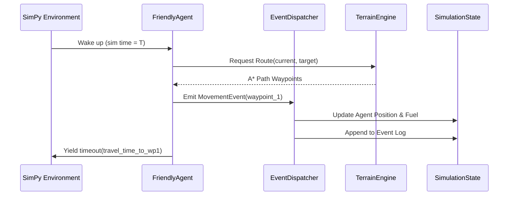
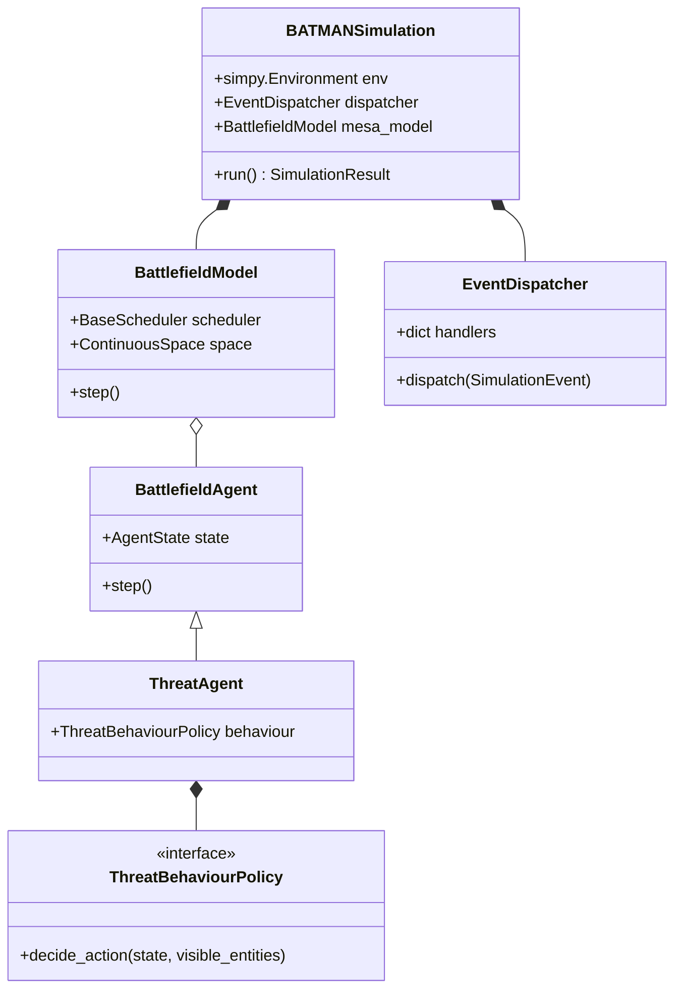

# BATMAN Phase 2: Simulation Design Specification

This document details the architectural design for hardening the Phase 2 War Gaming / Digital Twin simulation. It resolves the gaps identified in the `PHASE2_AUDIT.md` by transitioning the prototype into a strict event-driven, multi-agent digital twin.

---

## 1. Event Queue Design

The simulation moves away from a fixed 5-minute tick loop to a **Discrete Event Simulation (DES)** model. 
- **Backing Engine:** `simpy.Environment` acts as the underlying chronological priority queue. 
- **Time Representation:** Continuous float representing minutes since mission start (e.g., `12.5`).
- **Event Encapsulation:** Future events are scheduled by yielding `simpy.timeout()` events, wrapped with BATMAN-specific `SimulationEvent` metadata.

## 2. Event Dispatcher

The `EventDispatcher` is the central nervous system of the simulation. It decouples agents from direct state mutation.
- **Pattern:** Publisher-Subscriber / Dispatch Table.
- **Responsibility:** Agents do not mutate the `WorldState` directly. They emit a `SimulationEvent`. The Dispatcher receives the event, looks up the registered handler for the `SimulationEventType`, applies the physics/rules, mutates the state, and writes to the immutable `EventLog`.

## 3. SimPy Integration

`BATMANSimulation` will no longer manage a manual `_tick` loop. 
- It initializes a `simpy.Environment`.
- It spawns a primary `simpy.Process` for the Event Dispatcher.
- Agents run as independent `simpy.Process` generators that yield timeouts based on task durations or movement speeds.
- The simulation terminates when the SimPy event queue is empty, the time limit is reached, or the Dispatcher triggers a `MISSION_END` event.

## 4. Mesa Integration

Mesa will be integrated fully, rather than just subclassing `MesaAgent`.
- **Model:** A `BattlefieldModel` class inheriting from `mesa.Model`.
- **Scheduler:** Use `mesa.time.BaseScheduler` or `RandomActivation` to ensure agents are stepped fairly when concurrent events occur.
- **Spatial Grid:** Implement a `mesa.space.ContinuousSpace` (or `MultiGrid`) to represent the AOR. Agent `pos` attributes will strictly align with the `TerrainEngine` coordinates.

## 5. Agent Lifecycle

All agents (`FriendlyAgent`, `ThreatAgent`, `CivilianAgent`, `JudgeAgent`) follow a strict lifecycle:
1.  **Initialization:** Registered with the Mesa `BattlefieldModel` scheduler and spatial space.
2.  **Activation (Step):** Woken up by the SimPy event queue.
3.  **Observation:** Reads the read-only `WorldState` and visible entities in their spatial radius.
4.  **Decision:** Selects the next action.
5.  **Action Yielding:** Emits a `SimulationEvent` to the Dispatcher and yields a `simpy.timeout` for the duration of the action.
6.  **Termination:** If an agent becomes a casualty or completes all tasks, it is removed from the Mesa scheduler.

## 6. Movement Model

Current COA tasks are abstract (e.g., "Move to Obj A"). The new model simulates physical movement.
- **Routing:** `TerrainEngine.route()` generates an A* path of waypoints.
- **Traversal:** Agents traverse the path segment by segment.
- **Speed Calculation:** `TerrainEngine.movement_speed_kmh()` dynamically calculates speed per segment based on weather, slope, and trafficability.
- **Event Emission:** Each segment traversal emits a `MovementEvent`, moving the agent in the Mesa space and deducting exact fuel via the `LogisticsModel`.

## 7. Threat Behaviour Framework

Threats will no longer use a simple randomized contact check. They will use the **Strategy Pattern**.
- **Interface:** `ThreatBehaviourPolicy`
- **Implementations:**
    - `PatrolBehaviour`: Moves between predefined waypoints.
    - `AmbushBehaviour`: Remains stationary in high-cover terrain, scanning for friendly agents.
    - `ReconBehaviour`: Moves towards friendly agents but attempts to maintain distance.
    - `DefensiveBehaviour`: Fortifies objective locations.
- **Dynamic Selection:** `ThreatAgent` reads the `ThreatAssessment` injected from the planner to instantiate the correct policy at initialization.

## 8. Event Schema

Events are strongly typed, immutable dataclasses.

```python
@dataclass(frozen=True)
class SimulationEvent:
    event_type: SimulationEventType
    time_min: float
    agent_id: str

@dataclass(frozen=True)
class MovementEvent(SimulationEvent):
    origin: tuple[int, int]
    destination: tuple[int, int]
    fuel_consumed: float

@dataclass(frozen=True)
class EngagementEvent(SimulationEvent):
    target_id: str
    weapon_type: str
    hit_probability: float
    result_casualty: bool
```

## 9. Sequence Diagrams



## 10. Class Diagrams



## 11. Folder Structure

The `wargame-svc` will be restructured as follows:

```text
services/wargame-svc/
├── agents/
│   ├── battlefield.py       # Base Mesa agents
│   ├── behaviours.py        # ThreatBehaviourPolicy implementations
│   └── judge.py             # Read-only evaluation logic
├── comms/
├── logistics/
├── monte_carlo/
├── sensor/
├── simulation/
│   ├── engine.py            # BATMANSimulation & SimPy integration
│   ├── dispatcher.py        # EventDispatcher and handlers
│   ├── events.py            # Event dataclasses (MovementEvent, etc.)
│   ├── mesa_model.py        # BattlefieldModel and Grid setup
│   ├── scoring.py
│   └── statistics.py
├── terrain/
└── weather/
```

## 12. Public Interfaces

The integration boundary remains identical to ensure Phase 1 compatibility.

```python
# Main Entry Point
class BATMANSimulation:
    def __init__(self, mission: Mission, world_state: WorldState, coa: COA, config: SimulationConfig): ...
    
    def run(self) -> SimulationResult: ...

# Orchestrator Entry Point
class MonteCarloOrchestrator:
    def run(self, coa: COA, mission: Mission, world_state: WorldState, runs: int, workers: int) -> tuple[list[SimulationResult], OutcomeStatistics]: ...
```

## 13. Migration Plan

To maintain a passing test suite, hardening will occur in the following strict order:

1. **Contracts & Events:** Define `SimulationEvent` subclasses in `events.py` and expand shared contracts.
2. **Mesa Model Foundation:** Create `mesa_model.py`. Integrate `mesa.Model`, `ContinuousSpace`, and `BaseScheduler`.
3. **Event Dispatcher:** Implement `dispatcher.py` to handle state mutations safely.
4. **Agent Refactoring:** Update `agents/battlefield.py` to use the new Mesa model and yield events to the Dispatcher.
5. **Movement & Terrain:** Implement physical movement routing in `FriendlyAgent`.
6. **Threat Behaviours:** Implement the Strategy pattern in `behaviours.py` and update `ThreatAgent`.
7. **SimPy Integration:** Rewire `engine.py` to drop the fixed `_tick` loop and utilize the SimPy event queue wrapping the Mesa steps.
8. **Monte Carlo Parallelism:** Migrate `orchestrator.py` to `ProcessPoolExecutor` and inject uncertainty distributions.
9. **Statistics & Scoring:** Expand `statistics.py` and `scoring.py` to utilize the new high-fidelity data.
10. **Validation:** Run the 500-run benchmark test and verify output logs.
